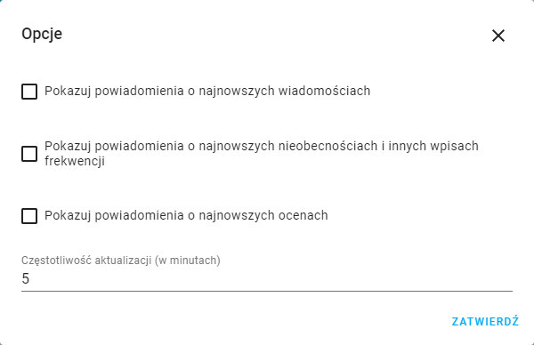
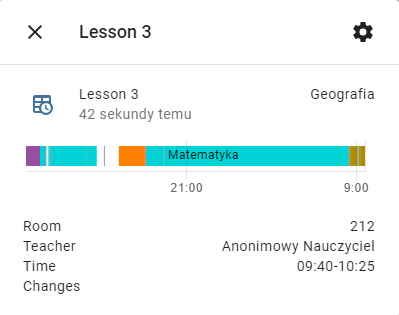

# Uonet+ Vulcan integration for Home Assistant

View your vulcan data as Home Assistant sensors and use it in automations. You can add multiple students by adding integration again.

## Get started
To get started login as mobile app in Integrations page. In integration options you can select student and enable notifications. Actually only one student is supported.  \n
You can easily add sensors to the lovelace interface using the "Add to Lovelace UI" option in the device page.

## Configuration
All integration settings are available in the options in the integration configuration panel.

## Timetable
Integration is creating ten entities for today and also ten for tomorrow. There are plans to add viewing entities in calendar.  

## Graders
Student's latest grade.  

## Messages
~Latest message sensor. You can activate notification in integration options.~
Actualy not available - new API doesn't have this feature yet, it will be added again soon.

## Attendance
Latest attendance sensor, you can enable notificatiosi in integration options.  

## Lucky Number
Student's lucky number.  

## Exam
Student's next Exam.  

## Homework
Student's next Homework.  

